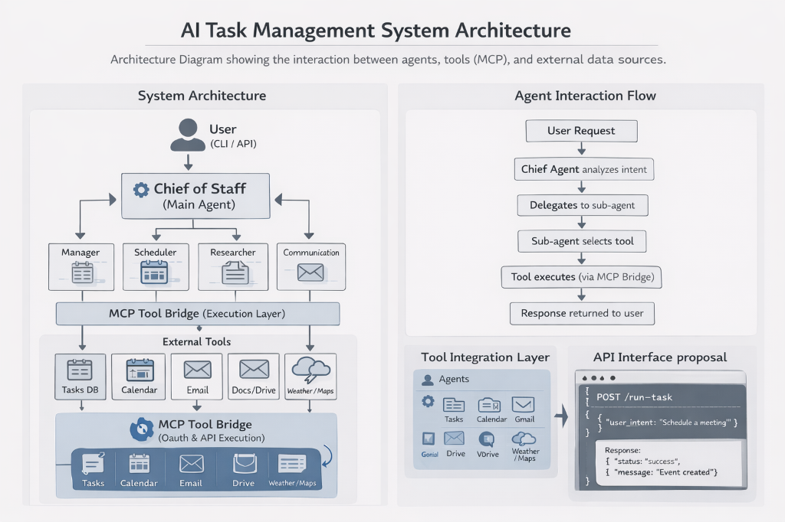
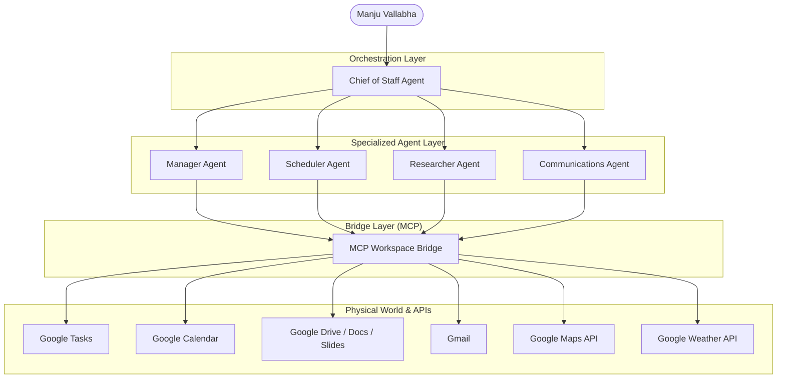

# 🏛️ Productivity Assistant: AI Multi-Agent Operations Manager

> **The "Chief of Staff" for the Modern Executive.**  
> *Developed for the Google GenAI APAC Region Cohort 1 Hackathon | Powered by Google ADK & Gemini.*


---

## 🌟 The Vision: A Unified Intelligence Layer

### 🛑 The Problem: The "Context Switch" Tax
In the modern workplace, productivity is throttled by **fragmentation**. Data is trapped in silos—emails in Gmail, tasks in GTasks, technical notes in Drive, and logistics in Maps/Weather apps. Executives and architects spend a significant portion of their "bandwidth" simply switching contexts and manually bridging these data points.

### 🏛️ The Solution: The "Chief of Staff" Paradox
The **Productivity Assistant** isn't just a chatbot; it is a **Unified Intelligence Layer**. It serves as a digital "Chief of Staff" that understands the holistic context of your day. By using Google's generative AI, it doesn't just respond to commands—it orchestrates actions.

### 🚀 Core Innovations
1.  **Dynamic Intent Delegation**: Unlike single-agent systems, our architecture uses a high-level **Chief of Staff Agent** that understands project hierarchy and delegates tasks to specialized sub-agents (Manager, Scheduler, Researcher, etc.).
2.  **Digital-to-Physical Bridge**: We bridge SaaS data (Google Workspace) with real-world logistics (Google Maps, Google Weather) to provide context-aware suggestions (e.g., "It's raining in Chennai; you should reschedule your outdoor site visit").
3.  **MCP-Native Integration**: Built on the **Model Context Protocol (MCP)**, the system features a robust "Tool Bridge" that executes real payload actions on Google APIs with precision and security.

### 🌐 Impact for the Google GenAI Hackathon
This project stands at the frontier of **Agentic Workflows**. It showcases a transition from "AI as a tool" to **"AI as an operator,"** capable of reasoning across multiple domains to save users hours of manual coordination every week.

---

## 🏗️ System Architecture

The project leverages the **Model Context Protocol (MCP)** and the **Google Agent Development Kit (ADK)** to create a layered intelligence stack.



### Architecture Detail (Logic Flow)


---

## 🤖 The Agent Team

| Agent | Role | Capability Highlights |
| :--- | :--- | :--- |
| **🤵 Chief of Staff** | Orchestrator | Analyzes user intent, delegates work, and synthesizes premium Markdown reports. |
| **📈 Manager** | Execution | Handles **Google Tasks**, tracks action items, and ensures project velocity. |
| **🕒 Scheduler** | Logistics | Manages **Calendar**, calculates **Maps** travel times, and monitors **Weather** conditions. |
| **🔍 Researcher** | Context | Reads/Writes **Google Docs**, fetches context from **Drive**, and performs web searches. |
| **📧 Communications** | Outreach | Drafts/Sends **Gmail**, and creates high-fidelity **Google Slides** presentations. |

---

## 🛠️ Tool-to-Tool Workspace Capabilities

The agents are powered by a suite of physical tools that interface directly with enterprise APIs. This "Tool Bridge" allows for atomic actions to be combined into complex workflows.

### 🍱 Productivity & Execution
- **`create_task`**: Deep integration with **Google Tasks**. Automates action item tracking.
- **`send_email`**: Drafts and dispatches professional communications via **Gmail**.
- **`write_doc`**: Generates and formats new **Google Docs** for reports and notes.
- **`create_presentation`**: Initializes **Google Slides** decks for executive summaries.

### 📅 Logistics & Operations
- **`list_calendar_events`**: Analyzes schedule density for the next N days.
- **`create_calendar_event`**: Handles event booking with full metadata (location, description).
- **`get_directions`**: Real-time traffic analysis and ETA calculation via **Google Maps**.
- **`get_current_weather`**: Fetches hyper-local climate data to inform travel and event planning.
- **`get_weather_forecast`**: Provides multi-day outlooks for proactive scheduling.

### 🔍 Knowledge & Research
- **`read_drive_doc`**: Performs deep-read operations on existing **Drive/Docs** files for context extraction.
- **`google_search`**: (Implicit) Uses Gemini's live web search capabilities for up-to-date market or technical research.

---

## ✨ Key Features

### 📅 Smart Logistics & Travel
The assistant doesn't just list your calendar; it checks the weather in your destination city (e.g., Chennai) and calculates travel times from your current location using live Google Maps data.

### 🧠 Deep Knowledge Management
Pull technical architecture documents from Google Drive, summarize them using Gemini's long-context window, and automatically generate email briefs or slide decks.

### 👔 Executive-Ready Synthesis
Every response is delivered in **Premium Markdown** with professional headers, bolded key stats, and clear calls to action, ensuring the user gets the "Bottom Line Up Front" (BLUF).

### 🔐 Enterprise-Grade Security
Uses OAuth 2.0 for secure, individual access to Google Workspace APIs, ensuring data privacy and scoped permissions.

---

## 🛠️ Tech Stack

- **Core Framework**: [Google Agent Development Kit (ADK)](https://github.com/google/adk)
- **Intelligence**: Google Gemini 2.5 Flash / Gemini 3.1 Flash Lite
- **Tool Protocol**: Model Context Protocol (MCP)
- **APIs**:
  - Google Workspace (Tasks, Calendar, Gmail, Drive, Docs, Slides)
  - Google Maps Platform (Directions & Geolocation)
  - Google Weather API
- **Language**: Python 3.10+

---

## 🚀 Getting Started

### 1. Prerequisites
- Python 3.10+ installed.
- A Google Cloud Project with the following APIs enabled:
  - Google Tasks, Calendar, Gmail, Drive, Docs, Slides.
  - Maps JavaScript API, Geocoding API.
- OAuth 2.0 Desktop/Web Client credentials (`client.json`).

### 2. Environment Configuration
Create a `.env` file in the project root:
```env
GOOGLE_API_KEY="your_api_key"
GCP_API_KEY="your_api_key"
GOOGLE_APPLICATION_CREDENTIALS="path/to/client.json"
MODEL_NAME="gemini-3.1-flash-lite-preview"
```

### 3. Installation
```powershell
pip install -r requirements.txt
```

### 4. Running the Assistant
```powershell
# Run the local web UI
adk web
```

---

## 🎬 Demo Scenario: "The Senior Architect's Audit"

1.  **Sync**: "Start my daily sync and list my calendar."
2.  **Travel**: "Check Chennai weather for my 4:30 PM audit at IIT Madras and calculate travel time from T. Nagar."
3.  **Synthesis**: "Summarize the 'Cloud Architecture 2026' doc and create a task to review autoscaling."
4.  **Reporting**: "Generate a slide deck for the 'Q3 Scalability Roadmap' and email the brief to the team."

---

## 🛡️ License
Distributed under the MIT License. See `LICENSE` for more information.

---

**Developed with ❤️ for the Google GenAI APAC Region Cohort 1 Hackathon by Team Agentra - Manju Vallabha.**
